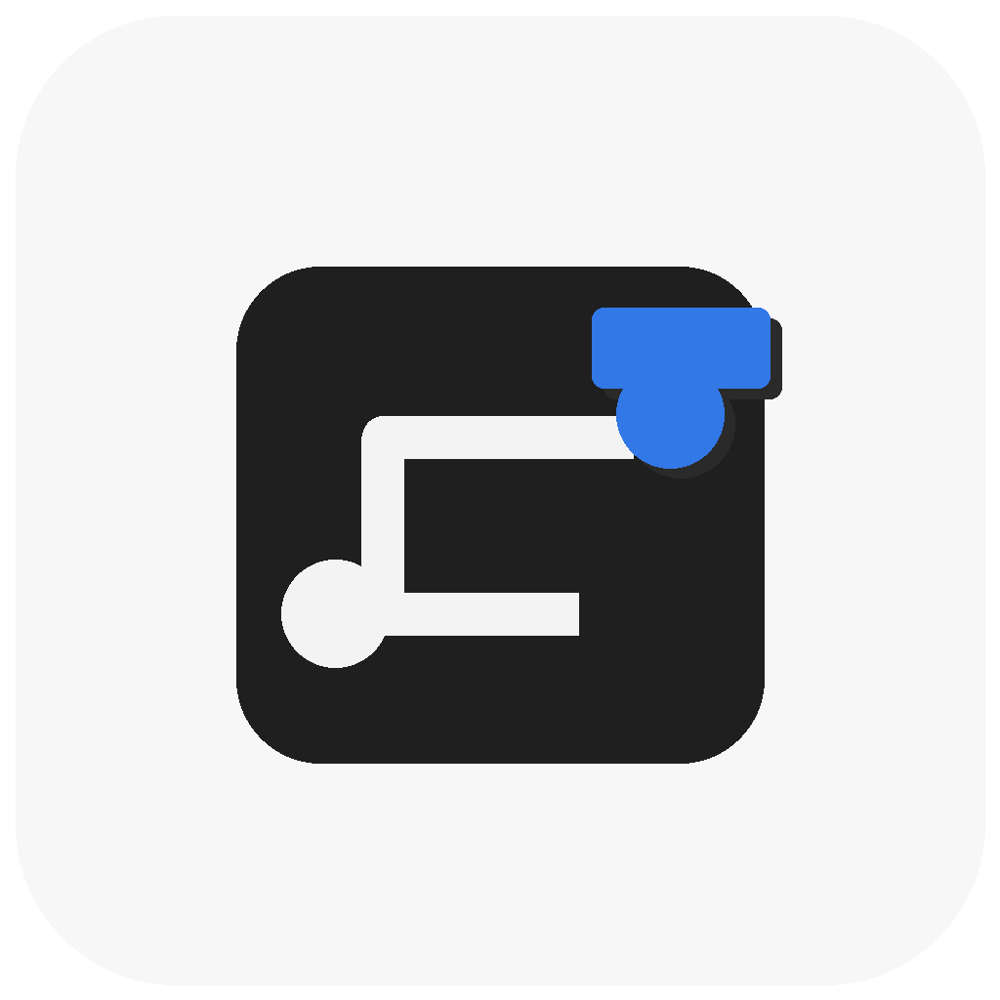

<p align="center">
  
</p>

# ACRouting

<p align="center">
  SwiftUI-first routing package for predictable navigation flows.
</p>

`ACRouting` is a SwiftUI-first routing package built to keep navigation concerns
out of feature views and centralize transitions behind a single `Router` API.

Documentation:
- Hosted docs: [acrouting.acasto.dev](https://acrouting.acasto.dev)
- Docs hosting setup: [HostedDocumentation.md](docs/HostedDocumentation.md)
- Current public package release: `1.4.4`

## Why ACRouting

- Single routing abstraction for push, sheet, full screen, alert, and custom modal.
- No direct `NavigationStack` management inside feature screens.
- Builder-first friendly: the app can keep screen assembly in builders, factories, or a composition root.
- Router access can be done via environment injection or explicit dependency
  passing.
- Presented destinations are wrapped in `RouterView` so routing remains available
  at every level.

## Platform and Tooling

- Swift tools: `6.2`
- Supported Apple platforms:
  - iOS `16+`
  - macOS `13+`

Notes:
- The package manifest matches the SwiftUI navigation APIs used by the current implementation.
- `showScreen(.fullScreenCover)` uses the native full-screen presentation on iOS.
- On macOS, SwiftUI does not expose `fullScreenCover`, so the package intentionally falls back to `.sheet` while keeping the same public API.

## Installation

### Xcode

1. Open `File > Add Package Dependencies...`
2. Use: `https://github.com/antoniocasto/ACRouting.git`
3. Pick your branch/tag/version.

### `Package.swift`

```swift
dependencies: [
    .package(url: "https://github.com/antoniocasto/ACRouting.git", from: "1.4.4")
],
targets: [
    .target(
        name: "YourApp",
        dependencies: [
            .product(name: "ACRouting", package: "ACRouting")
        ]
    )
]
```

## Quick Start

### 1) Wrap your root view with `RouterView`

```swift
import SwiftUI
import ACRouting

@main
struct DemoApp: App {
    var body: some Scene {
        WindowGroup {
            RouterView { _ in
                HomeView()
            }
        }
    }
}
```

### 2) Pick your router access style

Environment injection is supported and convenient, but not mandatory. Inline destination builders are fine for small flows, while larger apps can keep screen assembly outside `ACRouting` through app-owned builders or factories.

#### Option A: Environment (`@Environment(\.router)`)

```swift
import SwiftUI
import ACRouting

struct HomeView: View {
    @Environment(\.router) private var router

    var body: some View {
        VStack(spacing: 12) {
            Button("Push detail") {
                router.showScreen(.push) { _ in
                    DetailView()
                }
            }

            Button("Open sheet") {
                router.showScreen(.sheet) { _ in
                    SheetRootView()
                }
            }

            Button("Open full screen") {
                router.showScreen(.fullScreenCover) { _ in
                    FullScreenRootView()
                }
            }
        }
    }
}
```

#### Option B: Explicit dependency passing

```swift
import SwiftUI
import ACRouting

@main
struct DemoApp: App {
    var body: some Scene {
        WindowGroup {
            RouterView { router in
                HomeView(router: router)
            }
        }
    }
}

struct HomeView: View {
    private let router: any Router

    init(router: any Router) {
        self.router = router
    }

    var body: some View {
        Button("Push detail") {
            router.showScreen(.push) { _ in
                DetailView()
            }
        }
    }
}
```

#### Option C: Builder-owned screen assembly

`ACRouting` owns navigation state. Your app can keep screen assembly in builders and expose only an app-owned router interface to feature screens.

```swift
import SwiftUI
import ACRouting

protocol CatalogRouting {
    func showProfile(userID: UUID)
    func showSettings()
}

struct CatalogBuilder {
    func makeHomeScreen(router: any CatalogRouting) -> some View {
        CatalogHomeView(router: router)
    }

    func makeProfileScreen(userID: UUID, router: any CatalogRouting) -> some View {
        ProfileView(userID: userID, router: router)
    }

    func makeSettingsScreen(router: any CatalogRouting) -> some View {
        SettingsView(router: router)
    }
}

struct CatalogRouterAdapter: CatalogRouting {
    let acRouter: any Router
    let builder: CatalogBuilder

    func showProfile(userID: UUID) {
        acRouter.showScreen(.push) { router in
            let appRouter = CatalogRouterAdapter(acRouter: router, builder: builder)
            builder.makeProfileScreen(userID: userID, router: appRouter)
        }
    }

    func showSettings() {
        acRouter.showScreen(.sheet) { router in
            let appRouter = CatalogRouterAdapter(acRouter: router, builder: builder)
            builder.makeSettingsScreen(router: appRouter)
        }
    }
}

@main
struct DemoApp: App {
    private let builder = CatalogBuilder()

    var body: some Scene {
        WindowGroup {
            RouterView { router in
                let appRouter = CatalogRouterAdapter(acRouter: router, builder: builder)
                builder.makeHomeScreen(router: appRouter)
            }
        }
    }
}
```

This pattern keeps `ACRouting` focused on pushes, modal presentation, and dismissal semantics while your app continues to own screen assembly.

### 3) Dismiss current context

```swift
@Environment(\.router) private var router

Button("Close") {
    router.dismissScreen()
}
```

Current behavior:
- In a pushed destination, `dismissScreen()` pops the current pushed screen from the inherited stack.
- In a sheet or full-screen flow root, it dismisses the presented modal context.
- For push flows, prefer the explicit stack APIs below when you want deterministic navigation control.
- Use `dismissAncestorModal()` from a pushed child inside a sheet or full-screen flow when you need to close that ancestor routed modal explicitly.

### 4) Dismiss an ancestor modal from a pushed child

```swift
@Environment(\.router) private var router

Button("Close Sheet") {
    router.dismissAncestorModal()
}
```

Current behavior:
- `dismissAncestorModal()` targets the first ancestor routed modal created with `.sheet` or `.fullScreenCover`.
- It does not dismiss overlays shown with `showModal`.
- If no ancestor routed modal exists, the call is a no-op.

### 5) Control the push stack explicitly

```swift
@Environment(\.router) private var router

Button("Back") {
    router.pop()
}

Button("Pop two screens") {
    router.pop(count: 2)
}

Button("Back to root") {
    router.popToRoot()
}
```

## Routing Options

- `.push`: appends to the current stack.
- `.sheet`: presents a new modal navigation context with its own routed flow.
- `.fullScreenCover`: presents a fullscreen modal navigation context on iOS and a sheet-backed equivalent on macOS.

## Supported Modal Layering in `1.4.4`

First-class supported flows:
- Root flow with push navigation.
- One routed `.sheet` flow with its own local push stack.
- One routed `.fullScreenCover` flow with its own local push stack.
- A `showModal` overlay inside the current router context, including root, pushed, sheet-root, or full-screen-root screens.
- A pushed child inside one routed `.sheet` or `.fullScreenCover` flow calling `dismissAncestorModal()` to close that first ancestor routed modal.

Current limits and out-of-scope combinations:
- `dismissAncestorModal()` targets only the first ancestor routed `.sheet` or `.fullScreenCover`.
- `showModal` remains an overlay API; it does not create a routed modal container and is never a dismiss target for `dismissAncestorModal()`.
- Behavior is documented and regression-covered for one ancestor routed modal at a time.
- Presenting one routed `.sheet` or `.fullScreenCover` from inside another routed `.sheet` or `.fullScreenCover` is not first-class in `1.4.4`.

## Alerts

Examples below assume you already have a `router` instance (from either option above).

```swift
@Environment(\.router) private var router

router.showAlert(
    .alert,
    title: "Delete item",
    subtitle: "This action cannot be undone."
) {
    AnyView(
        Group {
            Button("Cancel", role: .cancel) {}
            Button("Delete", role: .destructive) {}
        }
    )
}
```

Error shortcut:

```swift
router.showErrorAlert(error: myError)
```

Dismiss current alert:

```swift
router.dismissAlert()
```

## Custom Overlay Modal

```swift
router.showModal(
    backgroundColor: .black.opacity(0.5),
    backgroundTransition: .opacity,
    animation: .smooth,
    backgroundTapDismissesModal: true
) {
    MyCustomModalView()
}
```

Dismiss:

```swift
router.dismissModal()
```

Notes:
- `showModal` is intended for lightweight overlay UI such as custom alerts, confirmation cards, or loading blockers.
- Unlike `.sheet` and `.fullScreenCover`, it does not start a new routed flow.

## Architecture Notes

- `RouterView` is both a `View` and a `Router`.
- Child destinations are wrapped again in `RouterView`, so every screen still has
  access to a router.
- App-owned builders, factories, or router adapters can keep screen assembly outside `ACRouting`.
- Push navigation uses a shared destination stack where appropriate.
- Sheet/fullscreen routes create a fresh navigation context for the presented
  flow.

## Current Routing Model

- Navigation state is currently stored as `AnyDestination`, which wraps concrete SwiftUI views.
- The package is designed to keep routing available across pushes and modal flows, not to model routes as typed values yet.
- Pushed child flows mutate an inherited destination stack explicitly through `pop()`, `pop(count:)`, and `popToRoot()`.
- `dismissScreen()` remains available as a compatibility API and delegates to explicit pop behavior for pushed destinations.
- `dismissAncestorModal()` lets a pushed child explicitly close its first ancestor routed modal without changing `dismissScreen()` semantics.
- Routed `.sheet` and `.fullScreenCover` state now share one internal presentation model, while `showModal` intentionally stays a separate overlay API instead of another routed modal container.
- If a view reads `@Environment(\.router)` outside `RouterView`, the default fallback is a `MockRouter` that avoids crashes and emits debug guidance explaining how to inject a real router.

## Internal Preview Catalog

The package now includes a debug-only preview catalog for local exploration in Xcode:

- File: [`Sources/ACRouting/Previews/ACRoutingPreviewCatalog.swift`](Sources/ACRouting/Previews/ACRoutingPreviewCatalog.swift)
- Scope:
  - explicit push-stack control
  - builder-first integration through an app-owned router adapter
  - sheet and full-screen modal roots
  - alert and overlay semantics
  - a realistic mixed checkout-style flow built only from currently supported APIs

This catalog is meant for package contributors and local study after cloning the repository. It is not part of the public API surface.

## Development

```bash
swift build
swift test
```

## Credits

This package was built while following the **SwiftUI Advanced Architectures** course by [Nick Sarno](https://github.com/SwiftfulThinking).

- YouTube: [@SwiftfulThinking](https://www.youtube.com/@SwiftfulThinking)
- Course: SwiftUI Advanced Architectures

## License

MIT. See [LICENSE.md](LICENSE.md).
